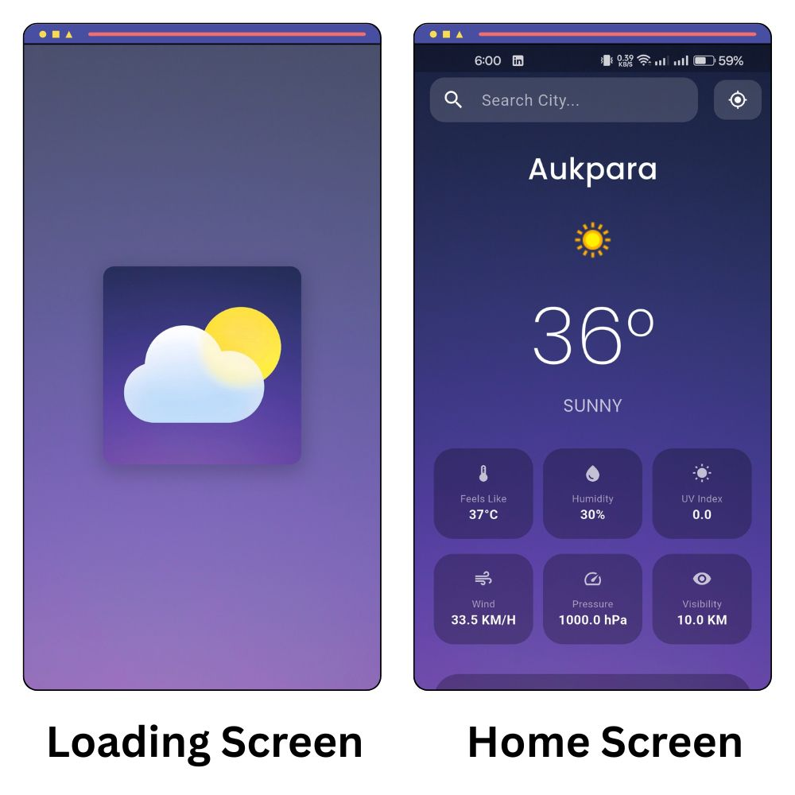

# SkyCast

A smart weather application that provides real-time forecasts, alerts, and essential weather insights to help users plan their day effectively.

## UI Demo

## Features

- Location-based weather updates  
- Real-time temperature and “feels like” data  
- Humidity, wind speed, and UV index  
- Current weather conditions (Cloudy, Rain, Clear, etc.)  
- Clean and user-friendly interface  
- Fast and lightweight performance  


## Tech Stack

- Flutter  
- Dart  
- Weather API 
- Firebase Firestore 


## APK Download
### Release Version  
[Download APK](./app-release/app-release.apk)

## API Setup

Get your API key from your weather service provider (ex: www.weatherapi.com)  
Add the key in your project:  
    ```dart
    const apiKey = "YOUR_API_KEY";
    ```
## Author

**Mahmud Abbas Mehedi**  
CSE Student  
Interested in app development and problem solving
